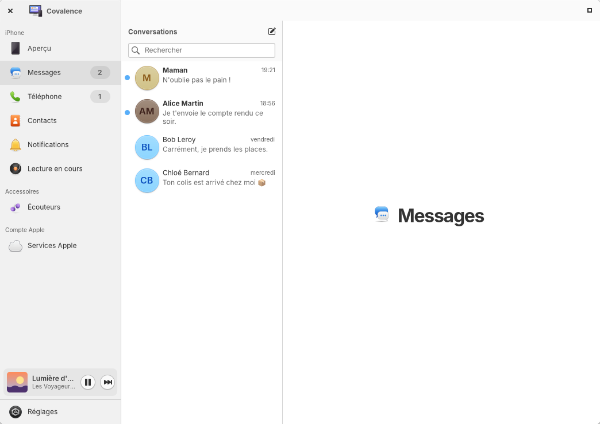
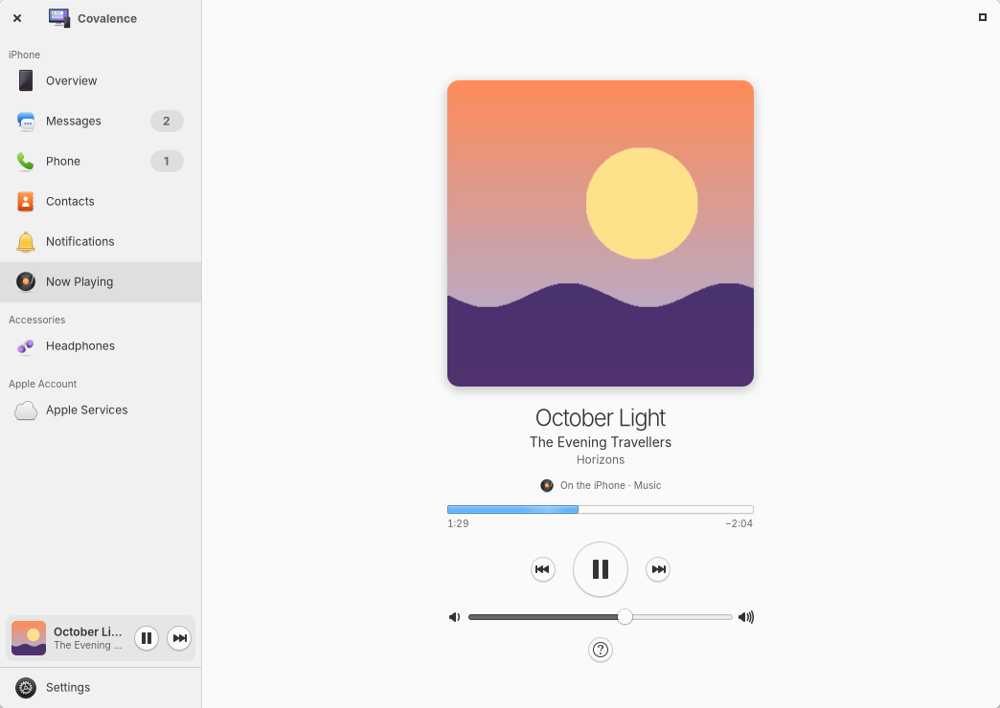
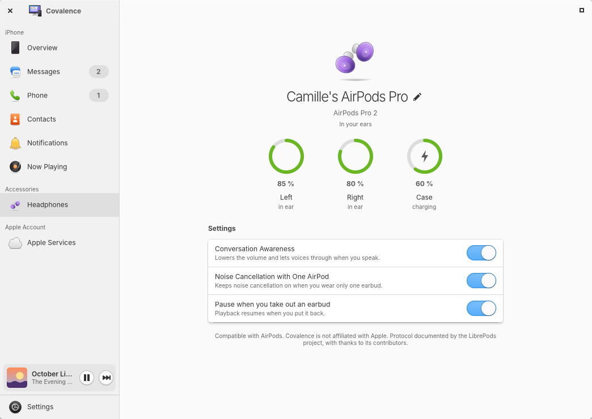

<div align="center">


# Covalence

**Votre iPhone et votre compte Apple, chez eux sur elementary OS.**

[](LICENSE)


[Site](https://melvincouwez-alt.github.io/covalence/fr/) ·
[Télécharger](https://github.com/melvincouwez-alt/covalence/releases/latest) ·
[English](README.md)


</div>

Covalence amène l'iPhone et iCloud sur elementary OS : notifications, messages, appels,
contacts, AirPods, courriel, agendas, rappels, iCloud Drive et Photos. Tout tourne sur votre
ordinateur. L'iPhone passe par le Bluetooth, iCloud par Internet, et rien ne transite par un
serveur à nous.

> **Alpha.** La version 0.2 est un premier aperçu public. Elle sert tous les jours sur
> l'ordinateur de son auteur, mais attendez-vous à quelques accrocs. L'interface est en
> français, l'anglais est en bêta.

## Deux connexions

### Connexion iPhone (Bluetooth)

| | |
|---|---|
| **Notifications** | Toutes les notifications de l'iPhone sur le bureau, avec leurs actions et l'icône de l'app qui les envoie. Vous choisissez les apps affichées. |
| **Lecture en cours** | Ce que joue l'iPhone, avec pochette, progression et volume, dans sa page et dans un mini-lecteur au-dessus de Réglages. Lecture relance la musique de l'iPhone même à l'arrêt. |
| **Batterie** | Niveau dans le panneau, alertes à 20 % et 10 %. |
| **Messages** | Lire vos conversations SMS, répondre à une personne, brouillons, recherche. Supprimer un message ou une conversation de Covalence (il reste sur l'iPhone). |
| **Téléphone** | Répondre, refuser et passer des appels avec le micro et les haut-parleurs de l'ordinateur, clavier, journal d'appels. Demande PipeWire 1.4 ou plus récent. |
| **Contacts** | Les contacts de l'iPhone en Bluetooth (lecture seule), ou vos contacts iCloud, modifiables. |
| **AirPods** | Batterie de chaque écouteur et du boîtier, contrôle du bruit, détection de conversation, détection des oreilles, renommage. D'après le protocole documenté par LibrePods. |
| **Son de l'iPhone** | Envoyer le son de l'iPhone vers l'ordinateur depuis le bouton AirPlay, ou le refuser. |

<p align="center">


</p>

### Connexion Services Apple (Internet)

| | |
|---|---|
| **Courriel, agendas, rappels et contacts iCloud** | Ajoutés aux apps Courriel, Tâches et agenda d'elementary par Evolution Data Server, avec un mot de passe pour app. |
| **iCloud Drive** | Un dossier dans Fichiers, grâce à [rclone](https://rclone.org). |
| **iCloud Photos** | Vos albums dans Fichiers, en lecture seule, grâce à rclone. |

<p align="center">


</p>

> **À propos d'iCloud Drive et Photos.** rclone se connecte comme le site icloud.com, avec le
> mot de passe de votre compte Apple et la double authentification. Apple ne propose pas cet
> accès officiellement : ses conditions d'utilisation d'iCloud limitent l'accès automatisé et
> l'autorisent à suspendre un compte. Il faut aussi désactiver la Protection avancée des
> données, ce qui réduit le chiffrement de bout en bout de vos données iCloud. Le jeton de
> connexion expire environ une fois par mois. Vous utilisez cette fonction à vos risques ;
> Covalence vous demande d'accepter ces risques avant la connexion.

## Installation

### Depuis le paquet (conseillé)

1. Téléchargez `covalence_0.2.0-1_amd64.deb` depuis la
   [dernière version](https://github.com/melvincouwez-alt/covalence/releases/latest).
2. Double-cliquez dessus. Eddy (elementary OS) ou l'App Center (Ubuntu) installe Covalence et
   tous les paquets nécessaires. En terminal : `sudo apt install ./covalence_*.deb`.
3. Fermez puis rouvrez votre session (ou lancez `systemctl --user start covalenced`), puis
   ouvrez Covalence. L'assistant vous guide pour appairer l'iPhone et vous connecter à iCloud.

S'il manque quelque chose plus tard, Covalence l'affiche dans « Composants manquants » avec un
bouton « Installer » (PackageKit demande votre mot de passe). Pour iCloud Drive et Photos, le
bouton « Télécharger rclone » récupère la version officielle de rclone et vérifie son empreinte
SHA-256 (`covalenced --fetch-rclone` fait la même chose en terminal).

Désinstallation : `sudo apt remove covalence`. Vos données restent dans
`~/.local/share/covalence` et `~/.config/covalence` tant que vous ne les supprimez pas (voir
[confidentialité](docs/confidentialite.md)).

### Compatibilité

| Système | État |
|---|---|
| elementary OS 9 | Tout fonctionne. |
| elementary OS 8 | Tout sauf les appels : PipeWire 1.0 n'a pas d'API de téléphonie. Covalence grise les appels et explique pourquoi. |
| Ubuntu 24.04 ou plus récent | Demande Granite 7.7 ou plus récent. Les appels demandent PipeWire 1.4 ou plus récent. Ubuntu 24.04 fournit rclone 1.60, trop ancien pour iCloud : utilisez le bouton « Télécharger rclone ». |

Matériel : un adaptateur Bluetooth compatible Bluetooth Low Energy (presque tous les modèles
récents).

### Depuis les sources

```sh
meson setup build --prefix=$HOME/.local
ninja -C build && meson install -C build
systemctl --user daemon-reload && systemctl --user enable --now covalenced
```

Dépendances de construction : `valac`, `meson`, `libgranite-7-dev` (7.7 ou plus récent),
`libgtk-4-dev`. Les dépendances d'exécution sont listées dans `debian/control`. Tests hors
ligne : `python3 -m unittest tests.test_offline`. Paquet : `packaging/build-deb.sh`.

## Ce que Covalence ne sait pas faire

Des limites honnêtes, fixées surtout par ce qu'un iPhone accepte d'un ordinateur non Apple :

- Pas d'envoi d'iMessage, pas de réponse dans les groupes, pas de pièces jointes : le Bluetooth
  n'envoie qu'un SMS à une seule personne.
- Pas de presse-papiers universel, de Handoff, d'AirDrop ni de Caméra de continuité : il leur
  faut le chiffrement et la pile Wi-Fi d'Apple.
- Supprimer un message ne le retire que de Covalence. iOS ignore les suppressions par
  Bluetooth.
- L'iPhone ne se reconnecte pas toujours seul à un accessoire Bluetooth LE. Le
  [guide](data/guide/fr/12-troubleshooting.md) explique quoi faire.
- Déverrouiller l'ordinateur avec l'iPhone est volontairement exclu : la force du signal
  Bluetooth peut être falsifiée.

## Aide

Covalence contient un guide intégré, en français et en anglais (F1, ou Réglages › Guide). Il
explique l'appairage, les réglages à activer sur l'iPhone, iCloud, les AirPods et le
dépannage. Questions et signalements :
[Issues](https://github.com/melvincouwez-alt/covalence/issues).

## Qui le fait

Je ne suis pas développeur. Je suis un passionné d'elementary OS avec quelques idées et un
iPhone dans la poche, et je construis Covalence en « vibe coding » avec Claude, l'assistant
d'Anthropic : je décris ce que je veux, je teste tous les jours sur mon propre ordinateur, et
on corrige ensemble. Le code est ouvert pour que les personnes qui s'y connaissent mieux
puissent le lire, signaler les erreurs et aider. Contributions, signalements et conseils
bienveillants sont les bienvenus.

Melvin Couwez

## Comment ça marche

- **covalenced**, le service (Python, PyGObject) : il tient la liaison Bluetooth et les
  secrets. Il parle à l'iPhone par BlueZ (ANCS et AMS en Bluetooth LE, MAP et PBAP par obexd,
  HFP par `org.pipewire.Telephony` de PipeWire), à iCloud par Evolution Data Server et
  libsecret, et lance rclone pour Drive et Photos.
- **L'application** (Vala, GTK 4, Granite) : une fenêtre, plus des apps séparées Messages,
  Téléphone, Contacts et Écouteurs pour le dock. Elle parle au service par D-Bus
  (`io.github.melvincouwez.Covalence.Daemon`).
- Les journaux ne contiennent jamais le texte des notifications ou des messages, ni noms ni
  numéros.

## Merci

Covalence repose sur le travail de nombreux logiciels libres :

| Projet | Sert à | Licence |
|---|---|---|
| [rclone](https://github.com/rclone/rclone) (Nick Craig-Wood et contributeurs) | iCloud Drive et Photos | MIT |
| [LibrePods](https://github.com/librepods-org/librepods) (Kavish Devar et contributeurs) | Protocole des AirPods, porté en Python dans `covalenced/headphones.py` | GPL-3.0-or-later |
| [BlueZ](https://github.com/bluez/bluez) et obexd | Bluetooth, messages et contacts | GPL-2.0-or-later (bibliothèques LGPL-2.1-or-later) |
| [PipeWire](https://gitlab.freedesktop.org/pipewire/pipewire) et [WirePlumber](https://gitlab.freedesktop.org/pipewire/wireplumber) | Appels et son de l'iPhone | MIT |
| [Evolution Data Server](https://gitlab.gnome.org/GNOME/evolution-data-server) | Comptes iCloud | LGPL |
| [libsecret](https://gitlab.gnome.org/GNOME/libsecret) | Mots de passe dans le trousseau | LGPL-2.1-or-later |
| [GTK](https://gitlab.gnome.org/GNOME/gtk), [Granite](https://github.com/elementary/granite), [Vala](https://gitlab.gnome.org/GNOME/vala), [PyGObject](https://gitlab.gnome.org/GNOME/pygobject) | L'application et le service | LGPL (Granite : LGPL-3.0-or-later) |

Un merci particulier à l'équipe de LibrePods pour son remarquable travail de rétro-ingénierie,
et à [nRF Connect](https://www.nordicsemi.com/Products/Development-tools/nRF-Connect-for-mobile)
(Nordic Semiconductor), une app iPhone gratuite qui aide à lancer le premier appairage.

## Mentions légales

Covalence est un logiciel libre sous [licence GNU GPL version 3 ou ultérieure](LICENSE). Il est
fourni sans aucune garantie.

Covalence est un projet indépendant. Il n'est ni affilié à Apple Inc. ou à elementary, Inc., ni
approuvé, sponsorisé ou soutenu par eux. Apple, iPhone, iCloud, iMessage, AirPods, AirPlay et
Apple Music sont des marques d'Apple Inc., déposées aux États-Unis et dans d'autres pays et
régions. Elles ne sont citées que pour indiquer ce avec quoi Covalence fonctionne.

Covalence utilise des protocoles publiés (Bluetooth HFP, MAP, PBAP ; ANCS et AMS, spécifiés par
Apple ; CalDAV, CardDAV, IMAP). Deux fonctions reposent sur des interfaces non documentées : les
AirPods (protocole AAP décrit par LibrePods) et iCloud Drive et Photos (via rclone). Elles
peuvent cesser de fonctionner sans préavis. Covalence n'a décompilé aucun logiciel Apple.

- Confidentialité : [français](docs/confidentialite.md) · [English](docs/privacy.md). Pas de
  télémétrie, pas de compte, pas de serveur.
- Mentions légales : [docs/mentions-legales.md](docs/mentions-legales.md).
