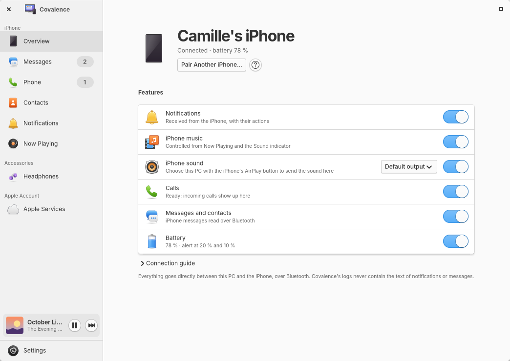
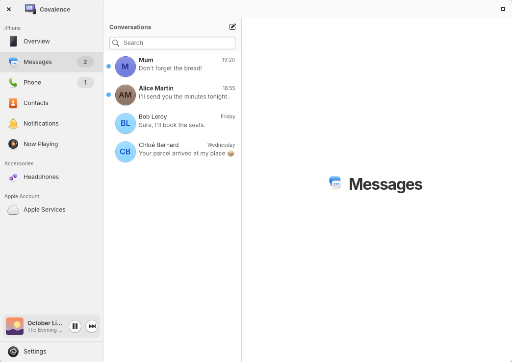

<div align="center">


# Covalence

**Your iPhone and your Apple account, at home on elementary OS.**

[](LICENSE)


[Website](https://melvincouwez-alt.github.io/covalence/) ·
[Download](https://github.com/melvincouwez-alt/covalence/releases/latest) ·
[Français](README.fr.md)



</div>

Covalence brings the iPhone and iCloud to elementary OS: notifications, messages, calls,
contacts, AirPods, iCloud mail, calendars, reminders, Drive and Photos. Everything runs on your
computer. The iPhone is reached over Bluetooth, iCloud over the Internet, and nothing goes
through a server of ours.

> **Alpha.** Version 0.5 is a public preview. It works every day on its author's computer,
> but expect rough edges. The interface is in French, with English in beta.

## Two connections

### iPhone connection (Bluetooth)

| | |
|---|---|
| **Notifications** | Every iPhone notification on the desktop, with its actions and the icon of the app that sent it. Choose which apps show up. |
| **Now Playing** | What the iPhone plays, with its cover, progress and volume, in its own page and in a mini player above Settings. Play starts the iPhone's music again even when it is stopped. |
| **Battery** | Level in the panel, alerts at 20 % and 10 %. |
| **Messages** | Read your SMS conversations, reply to one person, draft, search. Delete a message or a conversation from Covalence (it stays on the iPhone). |
| **Phone** | Answer, decline and place calls with the computer's microphone and speakers, dial pad, call history. Needs PipeWire 1.4 or later. |
| **Contacts** | The iPhone's contacts over Bluetooth (read only), or your iCloud contacts, which you can edit. |
| **AirPods** | Battery of each bud and the case, noise control, conversation awareness, ear detection, rename. Based on the protocol documented by LibrePods. |
| **iPhone sound** | Send the iPhone's audio to the computer from the AirPlay button, or refuse it. |

<p align="center">


</p>

### Apple Services connection (Internet)

| | |
|---|---|
| **iCloud Mail, Calendars, Reminders, Contacts** | Added to elementary's Mail, Tasks and calendar apps through Evolution Data Server, with an app-specific password. |
| **iCloud Drive** | A folder in Files, through [rclone](https://rclone.org). |
| **iCloud Photos** | Your albums in Files, read only, through rclone. |

<p align="center">


</p>

> **About iCloud Drive and Photos.** rclone signs in the way icloud.com does, with your Apple
> Account password and two-factor authentication. Apple does not offer this access officially:
> the iCloud terms limit automated access and allow Apple to suspend an account. It also needs
> Advanced Data Protection turned off, which reduces the end-to-end encryption of your iCloud
> data. The sign-in token expires about once a month. Use this feature at your own risk;
> Covalence asks you to accept these risks before signing in.

## Install

### From the package (recommended)

1. Download `covalence_0.5.0-1_amd64.deb` from the
   [latest release](https://github.com/melvincouwez-alt/covalence/releases/latest).
2. Double-click it. Eddy (elementary OS) or the App Center (Ubuntu) installs Covalence and every
   package it needs. In a terminal: `sudo apt install ./covalence_*.deb`.
3. Log out and back in (or run `systemctl --user start covalenced`), then open Covalence.
   The setup assistant guides you through pairing the iPhone and signing in to iCloud.

If something is missing later, Covalence lists it under "Missing components" with an
"Install" button (PackageKit asks for your password). For iCloud Drive and Photos, a
"Download rclone" button fetches the official rclone build and checks its SHA-256 checksum
(`covalenced --fetch-rclone` does the same in a terminal).

Uninstall with `sudo apt remove covalence`. Your data stays in `~/.local/share/covalence` and
`~/.config/covalence` until you delete them (see [privacy](docs/privacy.md)).

### Compatibility

| System | Status |
|---|---|
| elementary OS 8 or later | Everything works. Calls need PipeWire 1.4 or later: with an older PipeWire, Covalence greys the calls out and says why. |
| Ubuntu 24.04 or later | Needs Granite 7.7 or later. Calls need PipeWire 1.4 or later. Ubuntu 24.04 ships rclone 1.60, too old for iCloud: use the "Download rclone" button. |

Hardware: a Bluetooth adapter that supports Bluetooth Low Energy (almost all recent ones).

### From source

```sh
meson setup build --prefix=$HOME/.local
ninja -C build && meson install -C build
systemctl --user daemon-reload && systemctl --user enable --now covalenced
```

Build dependencies: `valac`, `meson`, `libgranite-7-dev` (7.7 or later), `libgtk-4-dev`.
Runtime dependencies are listed in `debian/control`. Offline tests:
`python3 -m unittest tests.test_offline`. Package: `packaging/build-deb.sh`.

## What it cannot do

Honest limits, mostly set by what an iPhone accepts from a non-Apple computer:

- No iMessage sending, no group replies, no attachments: Bluetooth only sends one-to-one SMS.
- No universal clipboard, Handoff, AirDrop or Continuity Camera: they need Apple's own
  encryption and Wi-Fi stack.
- Deleting a message only removes it from Covalence. iOS ignores deletions over Bluetooth.
- The iPhone does not always reconnect by itself to a Bluetooth LE accessory. The
  [guide](data/guide/en/12-troubleshooting.md) explains what to do.
- Unlocking the computer with the iPhone is left out on purpose: Bluetooth signal strength
  can be faked.

## New in 0.5

Since 0.3.3:

- **Steadier Bluetooth link**: pairing straight from the iPhone's Settings › Bluetooth (no
  more nRF Connect), no more connect/disconnect loops, reconnection that backs off and resumes
  after sleep, a clear "Pair again" when the iPhone forgot the PC.
- **Messages fixed**: no duplicates after a reconnection, group messages stay in their group,
  replies land in the right conversation, edited iMessages update in place.
- **Security pass**: pairing code confirmed on the PC, other programs must be allowed before
  calling or sending, updates checked again by a root helper, AirPlay protected by a PIN.
- **Internet through the iPhone** (Bluetooth tethering), **top bar indicator**, **proximity
  lock** (never unlocks), **message search**, pinned conversations, "mark as unread".
- **Files with LocalSend**, iCloud Drive status in Files, editable iCloud contacts, iCloud.com
  shortcuts, photo import over USB.
- **Screen mirroring** in its own app with UxPlay, and iPhone control from the PC through
  AssistiveTouch. Both are **experimental**, off by default.
- Settings in tabs, 19 free sounds, Guide in the sidebar, missing icons fixed.

## Help

Covalence has a built-in guide, in French and English (F1, or Guide in the sidebar). It walks
through pairing, the iPhone settings to turn on, iCloud, AirPods and troubleshooting.
Questions and bug reports: [Issues](https://github.com/melvincouwez-alt/covalence/issues).

## Who makes it

I am not a developer. I am an elementary OS fan with a few ideas and an iPhone in my pocket,
and I build Covalence by "vibe coding" with Claude, Anthropic's AI assistant: I describe what I
want, test it on my own computer every day, and we fix things together. The code is open so
that people who know better can read it, point out mistakes and help. Contributions, issues
and kind advice are very welcome.

Melvin Couwez

## How it works

- **covalenced**, the daemon (Python, PyGObject): owns the Bluetooth link and the secrets.
  It talks to the iPhone through BlueZ (ANCS and AMS over Bluetooth LE, MAP and PBAP through
  obexd, HFP through PipeWire's `org.pipewire.Telephony`), to iCloud through Evolution Data
  Server and libsecret, and runs rclone for Drive and Photos.
- **The app** (Vala, GTK 4, Granite): one window, plus separate Messages, Phone, Contacts and
  AirPods apps for the dock. It talks to the daemon over D-Bus
  (`io.github.melvincouwez.Covalence.Daemon`).
- Logs never contain notification or message text, names or numbers.

## Thanks

Covalence stands on the work of many free software projects:

| Project | Used for | License |
|---|---|---|
| [rclone](https://github.com/rclone/rclone) (Nick Craig-Wood and contributors) | iCloud Drive and Photos | MIT |
| [LibrePods](https://github.com/librepods-org/librepods) (Kavish Devar and contributors) | AirPods protocol, ported to Python in `covalenced/headphones.py` | GPL-3.0-or-later |
| [BlueZ](https://github.com/bluez/bluez) and obexd | Bluetooth, messages and contacts | GPL-2.0-or-later (libraries LGPL-2.1-or-later) |
| [PipeWire](https://gitlab.freedesktop.org/pipewire/pipewire) and [WirePlumber](https://gitlab.freedesktop.org/pipewire/wireplumber) | Calls and iPhone audio | MIT |
| [Evolution Data Server](https://gitlab.gnome.org/GNOME/evolution-data-server) | iCloud accounts | LGPL |
| [libsecret](https://gitlab.gnome.org/GNOME/libsecret) | Passwords in the keyring | LGPL-2.1-or-later |
| [GTK](https://gitlab.gnome.org/GNOME/gtk), [Granite](https://github.com/elementary/granite), [Vala](https://gitlab.gnome.org/GNOME/vala), [PyGObject](https://gitlab.gnome.org/GNOME/pygobject) | The app and the daemon | LGPL (Granite: LGPL-3.0-or-later) |

Special thanks to the LibrePods team for their remarkable reverse-engineering work, and to
[nRF Connect](https://www.nordicsemi.com/Products/Development-tools/nRF-Connect-for-mobile)
(Nordic Semiconductor), a free iPhone app that helped with the first pairings (no longer needed).

## Legal

Covalence is free software under the [GNU GPL version 3 or later](LICENSE). It comes with
absolutely no warranty.

Covalence is an independent project. It is not affiliated with, endorsed, sponsored or approved
by Apple Inc. or elementary, Inc. Apple, iPhone, iCloud, iMessage, AirPods, AirPlay and Apple
Music are trademarks of Apple Inc., registered in the U.S. and other countries and regions.
They are used here only to say what Covalence works with.

Covalence uses published protocols (Bluetooth HFP, MAP, PBAP; ANCS and AMS, specified by Apple;
CalDAV, CardDAV, IMAP). Two features rely on undocumented interfaces: AirPods (the AAP protocol
as described by LibrePods) and iCloud Drive and Photos (through rclone). They may stop working
without notice. Covalence has not decompiled any Apple software.

- Privacy: [English](docs/privacy.md) · [Français](docs/confidentialite.md). No telemetry, no
  account, no server.
- Legal notice (French): [docs/mentions-legales.md](docs/mentions-legales.md).
